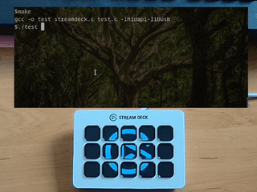

# StreamDeck V2 C Library

Author: Paul Banks (banksy) - web _AT_ paulbanks _DOT_ org

## Overview

Lightweight C library for Stream Deck V2.

Built and tested on Linux but uses cross platform hdiapi library for hardware comms so should work on other platforms too.

## Quick note about image format.

Image format is JPEG but not all features of JPEG are supported. In particular, colorspace must be RGB. (not Grey).

This ImageMagick command makes images that work:

convert input-image.png -resize 72 -colorspace sRGB -type truecolor -rotate 180 output-image.jpg

## Bugs

* Hardware sometimes indicates multiple keys pressed (>2) when just one key is pressed. We return
  the number of keys pressed. If it's greater than 2 you should discard the result.  

* Hardware can freeze if there's nobody there to read the keypresses. (e.g. you quit the program
  servicing the StreamDeck and then press buttons on it.) You have to re-plug it in those cases.

